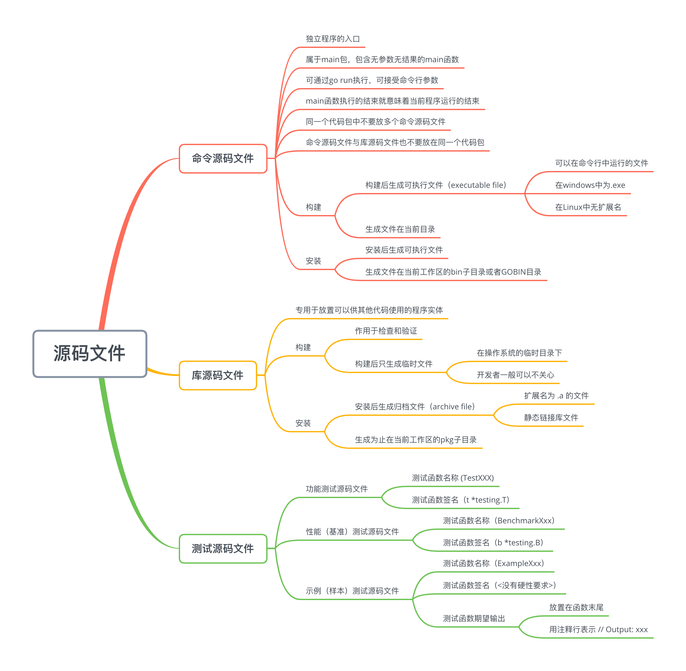

- 命令源码文件
- 库源码文件
- 测试源码文件



#### 命令源码文件
> 无参数声明 & 无结果声明
```golang
package main

import "fmt"

// 无参数声明 & 无结果声明的main函数
func main() {
  fmt.Println("Hello, world!")
}
```

> 可接受命令行参数
Go语言中flag代码包用于传递和接收参数
```
import "flag"

...

name := ""
flag.StringVar(&name, "name: argName", "value: DefaultValue", "Usage: argName describe")

...

flag.Parse() // 用于真正解析命令参数，并把它们的值付给相应的变量
// 对flag.Parse函数的调用必须在所有命令参数存储载体的声明(这里是name)和设置(这里是flag.StringVar函数的调用)之后,并且在读取任何命令参数值之前进行。所以一般放在main函数的最前面执行
fmt.Println(*name)
```
`go run main.go -name="hello, limingze"`
`hello, limingze`

完整示例
```
package main

import (
  "flag"
  "fmt"
)

var name string

func init() {
  flag.StringVar(&name, "name", "hello world", "usage example")
}

func main() {
  flag.Parse()
  fmt.Printf("Hello, %s!\n", name)
}

```


#### 库源码文件
> 库源码文件不能直接运行，他仅用于存放程序实体，这些程序实体可以被其他代码使用
> 同一个文件夹下，包的声明语句需要相同，代表同一个包
> 包名 **不需要** 和所在文件夹的名字相同
```
package main

import "fmt"

func Hello(name string)  {
	fmt.Println(name)
}

```

```
package main

func main() {
	Hello("limingze")
}
```

`go run main.go hello.go`
`go build -o xxx ../dirname`