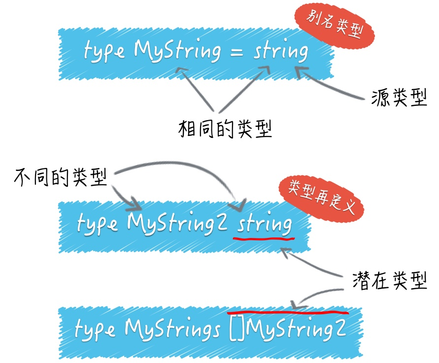

#### 变量定义
- var name string
- var name string = "limingze"
- var name = "limingze"
- name := "limingze"
- a, b := "hello", "limingze"

#### 变量的作用域
- 首先，最优先查找当前代码块中的那个变量。这里的当前指的是变量所在的代码块，不包含子代码块
- 其次，如果当前代码块中没有声明此变量，那么程序会沿着代码块的嵌套关系，从直接包含当前代码块的那个代码块开始，一层一层的查找（即父节点代码块）
- 最后，如果一直查找不到，Go的语言编译期会报错

#### 变量重声明 与 重名变量
> 变量重声明
```
var err error
n, err := io.WriteString(os.Stdout, "Hello, limingze")
```

> 重名变量
```
var n = "hello"
{
	var n = "hello2"
	fmt.Println(n)
}
fmt.Println(n)
```


#### 如何判断变量的类型
1. 断言
```
container := map[int]string{
  0: "zero",
  1: "one",
  2: "two"
}

value, ok := interface{}(container).([]string)
```
> ok 可以省略，value会被赋值。但是如果不符合断言类型的话会引发异常（panic），即运行时恐慌

> 类型断言表达式的语法形式是x.(T)。其中的x代表要被判断类型的值。这个值当下的类型必须是接口类型的，不过具体是哪个接口类型其实是无所谓的，所以当这里的container变量类型不是任何的接口类型时，我们需要先把他转成某个接口类型的值，如果container是某个接口类型的，那么这个类型断言表达式就可以是container.([]string)

> interface{} 代表空接口，任何类型都是他的实现类型。类似于java中的object

> {} 一对花括号的引申含义：他除了代表空的代码块之外，还可以用于表示不包含任何内容的数据结构（或者说数据类型）。比如 struct{} 就代表不包含任何字段和方法的空的结构体类型。interface{} 代表不包含任何方法定义的空的接口类型。类似的还有[]string{}、map[int]string{}


2. 反射


#### 类型转换（范围由宽变窄）
```
var srcInt = int16(-255)
dstInt := int8(srcInt)
```

`正数的补码等于原码，负数的补码是反码＋1。-255 是 由 255 各位取反后加1得到的`
255  -> `0000000011111111`
-255 -> `1111111100000000` + 1 = `1111111100000001`
-> `00000001` = 1


#### 别名类型
```
type MyString = string
```
> Go 语言内建的基本类型中就存在两个别名类型。byte是uint8的别名类型，rune是int32的别名类型

#### 类型再定义
```
type MyString2 string // 这里没有等号

type Celsius float64 // 摄氏温度
type Fahrenheit float64 // 华氏温度
```
> 上面的MyString2 和 string是两个不同的类型，MyString2不同于其他任何类型

> Celsius和Fahrenheit分别对应不同的温度单位。他们虽然有着相同的底层类型float64，但是他们是不同的数据类型，因此他们不可以被相互比较或者混在一个表达式中进行运算。刻意区分类型，可以避免一些无意中使用不同单位的温度混合计算导致错误



