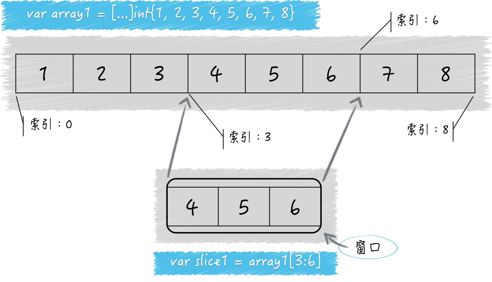

> 切片可以看做是对数组的一层简单封装
> 切片属于引用类型，切片也可以被看做是对数组的某个连续片段的引用
> 从传递成本角度讲，引用类型的值往往要比值类型的值传递低很多
> 在数组和切片上都可以应用索引表达式，得到的都是某个元素
> 在数组和切片上也可以应用切片表达式，也会得到一个新的切片
> len可以获得数组和切片的长度，cap可以获得他们的容量
> ****map和slice都是并发不安全的****

#### 长度、容量的含义
```
s1 := make([]int, 5)
s2 := make([]int, 5, 8)
```
> s1 的长度是5，容量是5
> s2 的长度是5，容量是8

`make的第三个参数如果省略的话，就默认跟第二个参数保持一致`
`前面提到切片是数组的连续引用，所以他的容量的含义就是底层引用数组的长度`

#### 生成新的切片
```
s3 := []int{1, 2, 3, 4, 5, 6, 7, 8}
s4 := s3[3:6]
```

- 切片的容量可以被看做是透过这个窗口最多可以看到的底层数组中元素的个数
- s3的底层数组就是s4的底层数组
- cap(s4) = cap(s3) - 3 = 5

#### 切片的“扩容”
- 扩容并不会改变原来的切片
- 生成一个容量是原切片2倍的新切片（如果原切片长度大于或者等于1024时，Go语言将会以原容量1.25倍作为新容量），然后将原有的元素和新元素一并拷贝到新切片中

#### List和Element
- List实现了一个双向链表
- Element实现了链表中的元素结构

#### 字典
> 字典的key可以是什么类型?
不可以是函数类型、字典类型、切片类型。否则会引起panic
总结：键类型必须支持判等操作，即 == 和 != 
```
var badMap2 = map[interface{}]int{
  "1":   1,
  []int{2}: 2, // 这里会引发panic。
  3:    3,
}
```

> 操作字典之前必须先初始化

未初始化的字典值会是nil。尝试对其增加元素时会发生panic


> 在map的创建中：

直接声明“var m map[int]string”的形式声明出来的m为nil,
采用make函数创建的map不为nil，可以进行添加键值对的操作。